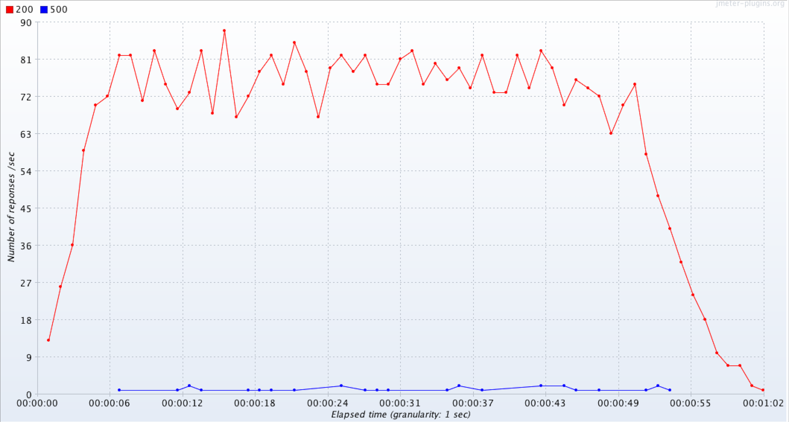

### NGINX and Node composed

This is an example of NGINX composed together with four node processes.

- The node server is set to fail 2% (random number, so results vary) of the time and shut down.
- The NGINX server will retry the next upstream when it gets a 502 or 503.
- Docker restarts processes that die.

This results in very high availability for the deployment.

---

### The Node App

The node application in this example uses domains to handle `uncaughtException` events. When such an error occurs, it will still crash the server, but gracefully — attempting to allow the inflight requests to complete.

If a new request comes in while the server is shutting down, a 503 will be issued.

### Examples

Here are two scenarios compared:

1. with node's `cluster` module handling load balancing among four
node processes, and child processes restarting automatically when failed.
2. with NGINX load balancing four standalone node processes and retrying next upstream on unavailable.

500s represent instances where an `uncaughtException` was handled and returned a 500 to user (expected).
When this occurs, the server will automatically 'gracefully' restart.

We do not want to see anything other than 200 or 500, since this would indicated availability issues.

*Node cluster with automatic restart of child*

*NGINX load balancing and docker automatic restart of process*

